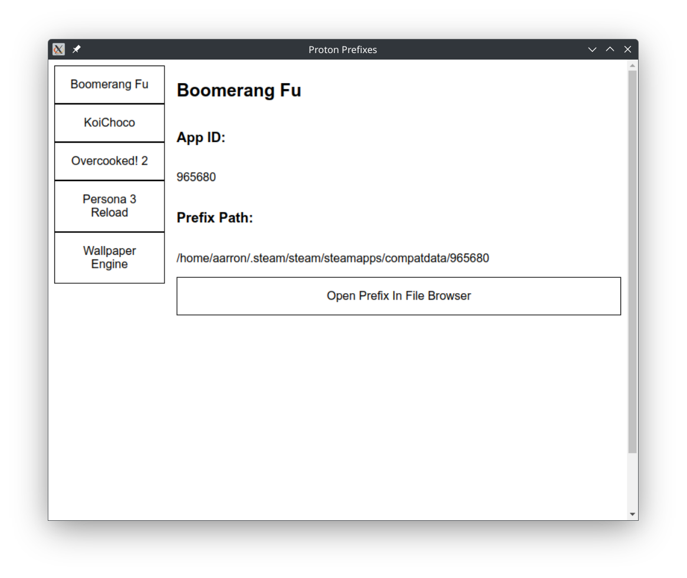

# ProtonPrefixes

A simple app for finding + opening proton prefixes

## Installation

- Download AppImage from releases
- Install the AppImage with your preferred AppImage manager, I'd recommend GearLever

# Build from source

- Clone git repository
- Open the project folder in your IDE
- run `npm install`
- run `npm run build`
- Built AppImage can be located at `./dist/`
